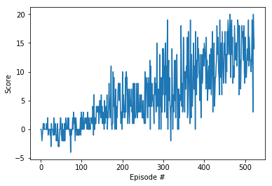
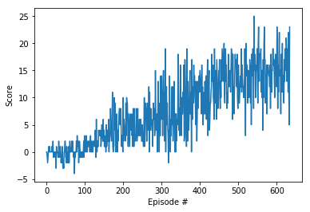

# Navigation
## DRLND: Deep Reinforcement Learning Project

In this project, an agent is trained to navigate (and collect bananas!) in a large, square world. 


## Environment
The simulation contains a single agent that navigates a large environment. At each time step, it has four actions at its disposal:

    0 - walk forward
    1 - walk backward
    2 - turn left
    3 - turn right

The state space has 37 dimensions and contains the agent's velocity, along with ray-based perception of objects around agent's forward direction. A reward of +1 is provided for collecting a yellow banana, and a reward of -1 is provided for collecting a blue banana.

A plot of rewards per episode is included to illustrate that the agent is able to receive an average reward (over 100 episodes) of at least +13. However the agent trains until it receives an average of 15 to enhance likelihood of reaching +13 in a trained test run.

The submission reports the number of episodes needed to solve the environment.

## Run Environment
To execute the code you need to have a prebuild unity environment (0.4.0) installed (https://s3-us-west-1.amazonaws.com/udacity-drlnd/P1/Banana/Banana_Windows_x86_64.zip) as well as following packages based on Python 3:
 - Pytorch
 - UnityEnvironment, unityagents
 - Numpy
 - Jupyter

To run and train the agent you can either run `DQN_Navigation.ipynb` (using jupyter notebook) or `python rldqn_navigation.py`.<br>
Code given below shows the DQN training cycle.
<br>
```
def dqn(n_episodes=2000, max_t=1000, eps_start=1.0, eps_end=0.01, eps_decay=0.995):
    """Deep Q-Learning.

    Params
    ======
        n_episodes (int): maximum number of training episodes
        max_t (int): maximum number of timesteps per episode
        eps_start (float): starting value of epsilon, for epsilon-greedy action selection
        eps_end (float): minimum value of epsilon
        eps_decay (float): multiplicative factor (per episode) for decreasing epsilon
    """
    scores = []                        # list containing scores from each episode
    scores_window = deque(maxlen=100)  # last 100 scores
    eps = eps_start                    # initialize epsilon
    for i_episode in range(1, n_episodes+1):                        # start episode
        env_info = env.reset(train_mode=True)[brain_name]           # reset unity environment and learn
        state = env_info.vector_observations[0]                     # get the current state
        score = 0                                                   # reset score per episode
        for t in range(max_t):
            action = agent.act(state, eps)                          # dqn_agent selects an action
            env_info = env.step(action)[brain_name]                 # send the action to unity environment
            next_state = env_info.vector_observations[0]            # get the next state from environment
            reward = env_info.rewards[0]                            # get the reward from environment
            done = env_info.local_done[0]                           # see if episode has finished
            agent.step(state, action, reward, next_state, done)     # dqn_agent performs next step
            state = next_state                                      # set new state
            score += reward                                         # update score
            if done:
                break
        scores_window.append(score)       # save most recent score
        scores.append(score)              # save most recent score
        eps = max(eps_end, eps_decay*eps) # decrease epsilon
        print('\rEpisode {}\tAverage Score: {:.2f}'.format(i_episode, np.mean(scores_window)), end="")
        if i_episode % 100 == 0:
            print('\rEpisode {}\tAverage Score: {:.2f}'.format(i_episode, np.mean(scores_window)))
        if np.mean(scores_window)>=15.0:  # An average of 15 can be obtained only going 200 episodes more
            print('\nEnvironment solved in {:d} episodes!\tAverage Score: {:.2f}'.format(i_episode, np.mean(scores_window)))
            torch.save(agent.qnetwork_local.state_dict(), 'checkpoint.pth')
            break
    return scores
```
To replay a trained network following code is used.
```
agent.qnetwork_local.load_state_dict(torch.load('checkpoint.pth'))

env_info = env.reset(train_mode=False)[brain_name]       # reset unity environment and learning prohibited
state = env_info.vector_observations[0]                  # get the current state from unity environment
score = 0                                                # initialize score
while True:
    action = agent.act(state)                            # dqn_agent selects an action
    env_info = env.step(action)[brain_name]              # action is provided to environment
    next_state = env_info.vector_observations[0]         # environment determines next state
    reward = env_info.rewards[0]                         # get the reward from environment
    done = env_info.local_done[0]                        # see if episode has finished
    score += reward                                      # update the score
    agent.step(state, action, reward, next_state, done)  # dqn_agent performs steps
    state = next_state                                   # set new state
    if done:                                             # exit loop if episode finished
        break

print("Score: {}".format(score))
```

## Result
A plot of reward is calculated every time you train the agent using `DQN_Navigation.ipynb`.

The plot for reaching +13 (in 523 episodes) is given in



Weights are provided in `trained_neuralnetwork_13.pth`.

A run with the submitted implementation aiming at +15 is provided under



The agent reached an average score of +15 after 635 episodes. Weights are provided in `trained_neuralnetwork_13.pth`.
 
## Learning Algorithm
The Agent contains two fully connected Q-Networks, a local and a target network, implementing a Double Network. The target Q-value of the local network is based on the received reward as well as the discounted Q-value of the next state. This Q-value is derived from the parameters of the target network and the action chosen by the local network.

```
# Q-Network
self.qnetwork_local = QNetwork(state_size=self.state_size, action_size=self.action_size, seed=SEED).to(device)
self.qnetwork_target = QNetwork(state_size=self.state_size, action_size=self.action_size, seed=SEED).to(device)

# Get max predicted Q values (for next states) from target model using Double DQN approach
# Target Q-value of qnetwork_local is based on the received reward as well as the discounted Q-value of the next state.
# This Q-value is derived from the parameters of the target network and the action chosen by the local network.
Q_actions_next = self.qnetwork_local(next_states).detach().argmax(1).unsqueeze(1)
Q_targets_next = self.qnetwork_target(next_states).detach().gather(1, Q_actions_next)
```

Local and target network are realising the Duelling Network approach. Therefore the classical hidden layers a followed by two additional streams which results are combined to the output layer.

```
    # Input layer
    self.fc1 = nn.Linear(state_size, 64)

    # create hidden layers according to HIDDEN_SIZES
    self.fc2 = nn.Linear(64, 128)
    self.fc3 = nn.Linear(128, 64)

    # create duelling layers according to DUELLING_SIZES
    self.adv_fc1 = nn.Linear(64, 64)
    self.val_fc1 = nn.Linear(64, 64)

    # Output layer
    self.adv_out = nn.Linear(64, action_size)
    self.val_out = nn.Linear(64, 1)


def forward(self, state):
    """Build a network that maps state -> action values. Forward propagation"""

    # classical network with relu activation function
    x = F.relu(self.fc1(state))
    x = F.relu(self.fc2(x))
    x = F.relu(self.fc3(x))

    # duelling strams adv and val
    adv, val = None, None
    adv = F.relu(self.adv_fc1(x))
    val = F.relu(self.val_fc1(x))
    adv = self.adv_out(adv)
    val = self.val_out(val).expand(x.size(0), self.action_size)

    # combing result of adv and val stream
    x = val + adv - adv.mean(1).unsqueeze(1).expand(x.size(0), self.action_size)

    return x
```

The ReplayBuffer stores experiences (of size BUFFER_SIZE) and allows the agent to randomly sample from these experiences. Experiences are treated uniformly.
```
    def step(self, state, action, reward, next_state, done):
        # Save experience in replay memory
        self.memory.add(state, action, reward, next_state, done)

        # Learn every UPDATE_EVERY time steps.
        self.t_step = (self.t_step + 1) % UPDATE_EVERY
        if self.t_step == 0:
            # If enough samples are available in memory, get random subset and learn
            if len(self.memory) > BATCH_SIZE:
                experiences = self.memory.sample()
                self.learn(experiences, GAMMA)
```
## Hyper Parameters
The following hyper parameters are used to train the DQN: 
 - `BUFFER_SIZE = int(1e5) # replay buffer size` 
 - `BATCH_SIZE = 64 # minibatch size` 
 - `GAMMA = 0.99 # discount factor` 
 - `TAU = 1e-3 # for soft update of target parameters` 
 - `LR = 5e-4 # learning rate` 
 - `UPDATE_EVERY = 4 # how often to update the network` 
 - `SEED = 0 # Providing seed for Qnetworks and ReplayBuffer`

More explanation is provided in the code itself.

## Ideas for Future Work
Currently only two optimization functions have been realized. Therefore
 - Prioritized experience replay
 - multi-step bootstrap targets
 - Distributional DQN
 - Noisy DQN 
 can still be added to further enhance the agent.

But even with the existing model hyper parameters can still be adjusted to improve Neural Network performance, specially layer sizes and
 - discount factor (GAMMA)
 - learning rate (LR)
 - update cycle (UPDATE_EVERY)
 - adapting epsilon function
 - change seed value
 - change activation function

